# Data Model — Musician Finder

This is the entity-relationship diagram for the Musician Finder domain. It renders
directly on GitHub. The diagram is a **human-readable reference** — the source of
truth is the Supabase migrations, and the generated TypeScript types
(`@/types/supabase`) close the loop to the frontend.

Terminology follows [`CONTEXT.md`](../CONTEXT.md). Key modeling decisions are recorded
as ADRs under [`docs/adr/`](./adr).

## Diagram

```mermaid
erDiagram
    MUSICIANS ||--o{ MUSICIAN_INSTRUMENTS : "plays"
    MUSICIANS ||--o{ MUSICIAN_GENRES : "likes"
    MUSICIANS ||--o{ MUSICIAN_AVAILABILITY : "is available for"
    MUSICIANS ||--o{ BAND_MEMBERS : "is linked as"
    MUSICIANS ||--o{ BANDS : "owns"
    MUSICIANS ||--o{ MUSICIAN_INFLUENCES : "is influenced by"

    INSTRUMENTS ||--o{ MUSICIAN_INSTRUMENTS : "referenced by"
    INSTRUMENTS ||--o{ BAND_OPENINGS : "referenced by"
    INSTRUMENTS ||--o{ BAND_MEMBERS : "referenced by"

    GENRES ||--o{ MUSICIAN_GENRES : "referenced by"
    GENRES ||--o{ BANDS : "categorizes"

    BANDS ||--o{ BAND_MEMBERS : "has"
    BANDS ||--o{ BAND_OPENINGS : "posts"
    BANDS ||--o{ BAND_GIGS : "schedules"
    BANDS ||--o{ BAND_INFLUENCES : "is influenced by"

    ZIP_CODES ||--o{ MUSICIANS : "locates"
    ZIP_CODES ||--o{ BANDS : "locates"

    MUSICIANS ||--o{ CONNECTIONS : "initiates"
    MUSICIANS ||--o{ CONNECTIONS : "receives"
    MUSICIANS ||--o{ MESSAGES : "sends"
    CONNECTIONS ||--o{ MESSAGES : "contains"

    MUSICIANS {
        uuid id PK
        uuid auth_user_id FK "-> auth.users, unique"
        text display_name
        date date_of_birth "age is derived, never stored"
        text zip_code FK "-> zip_codes.zip"
        text bio
        text avatar_url
        text spotify_url "embedded playlist link; deeper Spotify API integration is future scope"
        uuid primary_instrument_id FK "-> instruments, nullable"
        uuid primary_genre_id FK "-> genres, nullable"
        text affiliated_band_name "free text; only for an UNREGISTERED band (registered bands derive from band_members)"
        timestamptz created_at
        timestamptz updated_at
    }

    BANDS {
        uuid id PK
        uuid owner_musician_id FK "-> musicians"
        text name
        text zip_code FK "-> zip_codes.zip"
        text bio
        text avatar_url
        uuid genre_id FK "-> genres (exactly one)"
        timestamptz created_at
        timestamptz updated_at
    }

    INSTRUMENTS {
        uuid id PK
        text name "unique"
        text slug "unique"
        text category "brass | strings | percussion | keys | vocals | ..."
    }

    GENRES {
        uuid id PK
        text name "unique"
        text slug "unique"
    }

    MUSICIAN_INSTRUMENTS {
        uuid musician_id PK,FK
        uuid instrument_id PK,FK
        text proficiency "enum: beginner|intermediate|advanced|pro"
        bool is_primary
    }

    MUSICIAN_GENRES {
        uuid musician_id PK,FK
        uuid genre_id PK,FK
    }

    MUSICIAN_AVAILABILITY {
        uuid musician_id PK,FK
        text availability PK "enum: looking_to_join_band|session_work|lessons|touring|casual_jamming|not_available"
    }

    MUSICIAN_INFLUENCES {
        uuid id PK
        uuid musician_id FK
        text influence_name "free text in v1 (e.g. Guns N' Roses)"
        int rank "1..5, fewer allowed; unique per musician"
    }

    BAND_INFLUENCES {
        uuid id PK
        uuid band_id FK
        text influence_name "free text in v1"
        int rank "1..5, fewer allowed; unique per band"
    }

    BAND_MEMBERS {
        uuid id PK
        uuid band_id FK
        uuid musician_id FK "nullable — null = unregistered member"
        text member_name "shown when musician_id is null"
        uuid instrument_id FK "-> instruments, nullable"
        text role
        bool is_primary "true = band shown on musician's hover card (one primary per musician)"
        text status "enum: member|invited|pending"
        timestamptz joined_at
    }

    BAND_OPENINGS {
        uuid id PK
        uuid band_id FK
        uuid instrument_id FK "-> instruments"
        text description
        timestamptz created_at
    }

    BAND_GIGS {
        uuid id PK
        uuid band_id FK
        date gig_date
        text venue "free text in v1; future: nullable venue_id link to a registered Venue"
        text city
        text zip_code
    }

    CONNECTIONS {
        uuid id PK
        uuid initiator_id FK "-> musicians (sent the first message)"
        uuid addressee_id FK "-> musicians (received the request)"
        text status "enum: pending|accepted|declined|blocked"
        timestamptz created_at
        timestamptz responded_at "set when addressee first replies/accepts"
    }

    MESSAGES {
        uuid id PK
        uuid connection_id FK "-> connections (the thread)"
        uuid sender_id FK "-> musicians"
        text body
        timestamptz read_at
        timestamptz created_at
    }

    ZIP_CODES {
        text zip PK
        numeric latitude
        numeric longitude
        text city
        text state
    }
```

## Key decisions

**Band status is derived, not stored.** There is no `status` column on `BANDS`. A band is
"seeking members" when it has any rows in `BAND_OPENINGS`, and "not seeking" when it has
none. See [ADR 0001](./adr/0001-derive-band-status-dont-store-it.md).

**Instruments and genres are lookup tables, not enums.** The list of instruments and genres
grows as the app scales (brass, strings, percussion…), and instruments carry a `category`.
A growing, categorized, admin-managed list belongs in a table you can `INSERT` into — not
in a Postgres enum that requires a migration to extend.

**Availability is an enum used inside a join table.** A Musician can hold multiple
availability values (`MUSICIAN_AVAILABILITY` is a join table), but each value must be one of
a fixed, developer-owned set (the `availability` enum). Invariant: `not_available` is
exclusive and no rows = treated as `not_available`. See [`CONTEXT.md`](../CONTEXT.md).

**Band affiliation is derived from `BAND_MEMBERS`, not stored on the Musician.** A Musician
can be in multiple bands, so there is no single `affiliated_band_id` column (one column
cannot hold many bands). Affiliation to a **registered** band is derived from
`BAND_MEMBERS` rows, and the band shown on the Musician's hover card is the one row where
`is_primary = true` (enforce one primary per musician with a partial unique index:
`unique (musician_id) where is_primary`). This is a sibling of the "derive, don't store"
principle in [ADR 0001](./adr/0001-derive-band-status-dont-store-it.md).

**Membership links are nullable on purpose.** `BAND_MEMBERS.musician_id` is nullable so a
band can list members who aren't on the platform (`member_name` renders as plain text; a
registered `musician_id` renders as a hover profile card, and can be "claimed" later by
filling in the id). The mirror case — a Musician in an **unregistered** band — has no band
entity to point at, so it lives as free text in `MUSICIANS.affiliated_band_name`.

**Primary vs. secondary is a flag, not a separate table.** A Musician's card shows their
`primary_instrument_id` / `primary_genre_id` and primary band; their profile detail shows
every row in the `MUSICIAN_INSTRUMENTS` / `MUSICIAN_GENRES` / `BAND_MEMBERS` join tables.
`is_primary` distinguishes them — one consistent mechanism across instruments, genres, and
bands.

**Age is derived from `date_of_birth`, not stored.** Storing `age` as a number goes stale —
someone stays "24" forever unless something rewrites it. Storing the birth date and
computing age at read time keeps it always correct. This is the same "derive, don't store"
principle as band status ([ADR 0001](./adr/0001-derive-band-status-dont-store-it.md)),
`not_available`, and band affiliation.

**Influences are ranked free text in v1, kept in their own tables.** Both Musicians and Bands
list up to 5 influences (`MUSICIAN_INFLUENCES` / `BAND_INFLUENCES`), ordered by `rank` 1..5.
The cap is a **ceiling, not a quota** — fewer than 5 is valid, and forcing 5 would only push
users to pad with junk. Influences live in join tables rather than 5 columns on the parent so
the model can grow: an estimated ~99% of influences (Led Zeppelin, Foo Fighters) will never be
registered Bands, so no entity link is built now. **Future scope:** autocomplete the influence
field against the official Spotify Web API to store canonical, de-duplicated artist IDs (which
would unlock "you share an influence" match signals), and add a nullable `band_id` to link the
rare influence that _is_ a registered Band — reusing the same hover-card pattern as members.
Adding those columns later is a clean migration; the tables exist now precisely to keep that
door open.

**The first message _is_ the connection request (hybrid model).** Any registered Musician
may message any other, but a conversation carries a lifecycle so unsolicited messages don't
flood the main inbox. A `CONNECTIONS` row is the **thread** between a pair, and `MESSAGES`
belong to it (`connection_id`):

- Sending a first message creates the `CONNECTIONS` row as `pending` — it appears in the
  recipient's **requests** area, not their main inbox.
- When the addressee replies, `status` becomes `accepted` (`responded_at` is set) and the
  thread graduates to a normal conversation.
- `declined` / `blocked` cover the safety cases (block + report are still required
  regardless of model — important here because profiles include `age`).

There is exactly **one `CONNECTIONS` row per pair** (enforce a canonical ordering of the two
ids + a unique constraint) so a thread can't be duplicated. This keeps friction low (no
separate "send a blank friend request" step) while preserving a gate against spam.
